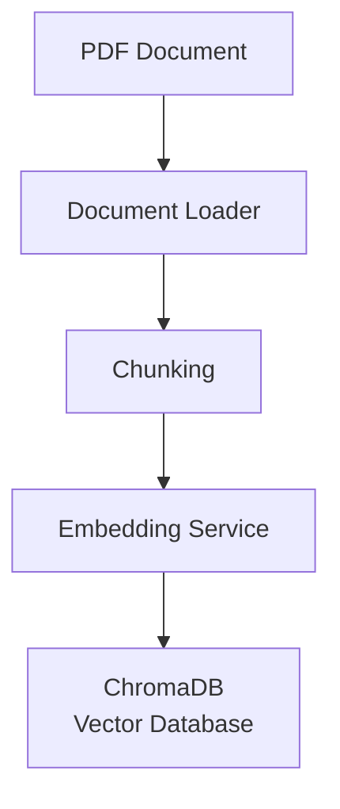
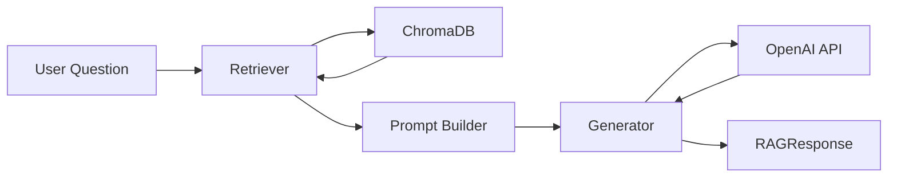
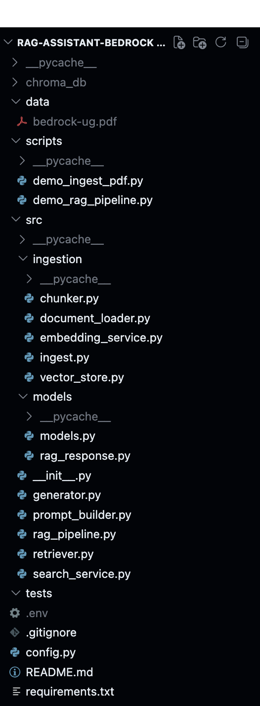
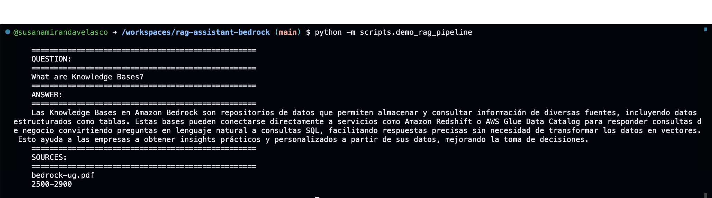

# AI Documentation Assistant (RAG)

AI Documentation Assistant helps users obtain accurate answers from large technical documents without having to read them from beginning to end. It is designed for anyone who needs to quickly understand a specific topic contained in a document.

The assistant uses Retrieval-Augmented Generation (RAG) to retrieve the most relevant information from the source document and generate grounded answers based exclusively on that context.

The assistant does not rely solely on the LLM's internal knowledge; instead, it grounds every answer using information retrieved from the provided documentation.

## Key Features

- Semantic retrieval using vector embeddings.
- Grounded responses generated from retrieved context.
- Modular architecture (Retriever, Prompt Builder, Generator).
- Source attribution for every answer.
- Clean and extensible RAG pipeline.

## Problem Statement

Large technical documents often contain valuable information, but finding a specific answer can be time-consuming and inefficient.

Traditional Large Language Models (LLMs) generate responses based on their training data and may hallucinate or provide outdated information when answering questions about specific documentation.

This project demonstrates how Retrieval-Augmented Generation (RAG) can improve answer quality by retrieving the most relevant information from a document before generating a response.

## What I Learned

Through this project I gained hands-on experience with:

- How embeddings enable semantic search.
- Why chunking strategy directly impacts retrieval quality.
- How a Retriever selects relevant context for an LLM.
- The difference between retrieval and generation.
- Why grounding reduces hallucinations.
- How to design a modular RAG architecture.
- How to separate internal models from public APIs (DTOs).

## Architecture

### Document Ingestion Pipeline



**The ingestion pipeline is executed only once for each document. Documents are split into chunks, converted into embeddings and stored in a vector database for efficient semantic retrieval.**

### Question Answering Pipeline



## Project Structure

The project is organized into independent components, each with a single responsibility.



```text
src/
├── ingestion/          # Document ingestion and indexing
│   ├── chunker.py
│   ├── document_loader.py
│   ├── embedding_service.py
│   ├── ingest.py
│   ├── vector_store.py
├── models/             # Shared data models
│   ├── rag_response.py
│   ├── models.py
├── generator.py        # LLM interaction
├── prompt_builder.py   # Prompt construction
├── rag_pipeline.py     # End-to-end orchestration
├── retriever.py        # Semantic retrieval
├── search_service.py   # Vector search abstraction
```

Each component has a single responsibility, making the system easier to understand, test and extend.

| Component           | Responsibility                                                     |
| ------------------- | ------------------------------------------------------------------ |
| `ingestion/`        | Loads documents, splits them into chunks and generates embeddings. |
| `retriever.py`      | Retrieves the most relevant chunks from ChromaDB.                  |
| `prompt_builder.py` | Combines the user question with retrieved context.                 |
| `generator.py`      | Generates the final answer using the LLM.                          |
| `rag_pipeline.py`   | Orchestrates the complete RAG workflow.                            |
| `models/`           | Shared domain models and DTOs.                                     |

## Example Output

The assistant retrieves the most relevant context from the indexed documentation and generates a grounded response, including the source document and page range.



## Design Decisions

- The project uses Retrieval-Augmented Generation instead of relying solely on the LLM.
- Components are separated into Retriever, Prompt Builder and Generator to keep responsibilities isolated.
- Public responses are returned through a dedicated DTO (RAGResponse), avoiding exposure of internal retrieval models.
- The ingestion pipeline is independent from the query pipeline, allowing documents to be indexed only once.

## Lessons Learned

Building this project helped me understand that implementing a RAG system goes far beyond connecting a vector database to an LLM.

Some of the most valuable lessons were:

- A good retrieval pipeline is often more important than the language model itself.
- Chunking strategy has a direct impact on retrieval quality and, therefore, on the final answer.
- Semantic search retrieves relevant information instead of exact keyword matches.
- Grounding responses with retrieved context significantly reduces hallucinations.
- Separating components (Retriever, Prompt Builder and Generator) makes the system easier to understand, test and evolve.
- Public APIs should expose dedicated models instead of internal implementation details.
- Product decisions, such as how to present sources and explain answers, are just as important as the underlying AI technology.
- Understanding why each component exists was far more valuable than simply learning how to use a framework.

## Future Improvements

The next planned iterations of this project include:

- Conversational memory to support multi-turn interactions.
- Automatic evaluation of RAG responses (Faithfulness and Groundedness).
- Tool Calling capabilities for external actions.
- Improved logging and observability.
- Support for multiple document collections.
